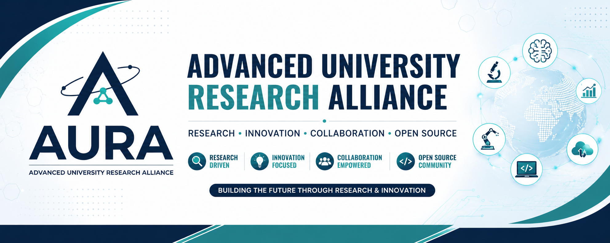

	

# Advanced University Research Alliance (AURA)

### Research • Innovation • Open Source • AI

Official GitHub Organization of the **Advanced University Research Alliance (AURA)**

**School of Engineering & Research (SER)**  
**ITM University, Raipur**

*"Building the Future Through Research & Innovation"*

---

# 🌟 About AURA

The **Advanced University Research Alliance (AURA)** is a research community under the **School of Engineering & Research (SER), ITM University, Raipur**.

AURA empowers students to explore emerging technologies, conduct impactful research, build innovative products, contribute to open-source projects, and collaborate with faculty mentors and industry experts.

Our mission is to cultivate a strong research culture where students transform ideas into real-world solutions.

---

# 🎯 Our Vision

> To become a leading university research community that nurtures innovation, interdisciplinary collaboration, and technological excellence.

---

# 🚀 What We Do

- 🔬 Research Projects
- 📄 Research Paper Publications
- 💡 Innovative Product Development
- 🧠 Artificial Intelligence & Machine Learning
- 🌐 Full Stack Web Development
- 📱 Mobile App Development
- ☁️ Cloud Computing
- 🔐 Cyber Security
- 📊 Data Science & Analytics
- 🤖 Robotics & IoT
- ⛓ Blockchain
- 🚀 Open Source Contributions
- 🏆 National & International Hackathons
- 📜 Patent & Copyright Filing

---

# 💻 Technologies We Explore

---

# 📂 Organization Repositories

Our repositories include:

- 📚 Research Papers
- 🧪 Experimental Projects
- 🌐 Websites
- 🤖 AI/ML Projects
- 📱 Mobile Applications
- ☁️ Cloud Projects
- 🔐 Cyber Security
- 📖 Documentation
- 💻 Open Source Contributions
- 🛠 Internal Development Tools

---

# 🤝 How to Contribute

We welcome contributions from AURA members.

1. 🍴 Fork the repository
2. 🌿 Create a feature branch
3. 💻 Make meaningful changes
4. ✅ Commit your work
5. 🚀 Open a Pull Request

Please ensure your code is:

- Well documented
- Properly tested
- Clean and readable
- Following project guidelines

---

# 🌍 Open Source Philosophy

At AURA, we believe:

> **Knowledge grows when it is shared.**

We encourage every member to

- ❤️ Contribute regularly
- 📖 Write documentation
- 🧹 Maintain clean code
- 👨‍💻 Review Pull Requests
- 💬 Help fellow researchers
- 🌎 Give back to the open-source community

---

# 👥 Who Can Join?

Students of **ITM University, Raipur** who are passionate about

- Research
- Innovation
- Programming
- Artificial Intelligence
- Data Science
- Open Source
- Emerging Technologies

---

# 📈 Our Goals

- Publish quality research papers
- Build impactful open-source projects
- Participate in global hackathons
- Develop innovative products
- Foster interdisciplinary collaboration
- Encourage continuous learning
- Represent ITM University globally

---

# 📬 Contact

🌐 **Website** - https://aura.itmuniversity.org

📧 **Email** -  aura@itmuniversity.org

---

# ⭐ Support Us

If you find our projects helpful,

⭐ Star the repositories

🍴 Fork them

💡 Contribute

🤝 Collaborate

📢 Share them with others

---

## 🚀 Together We Research, Innovate, and Inspire.

**Advanced University Research Alliance (AURA)**

*"Research Today. Innovate Tomorrow."*

---

Made with ❤️ by the members of **Advanced University Research Alliance (AURA)**

ITM University, Raipur

